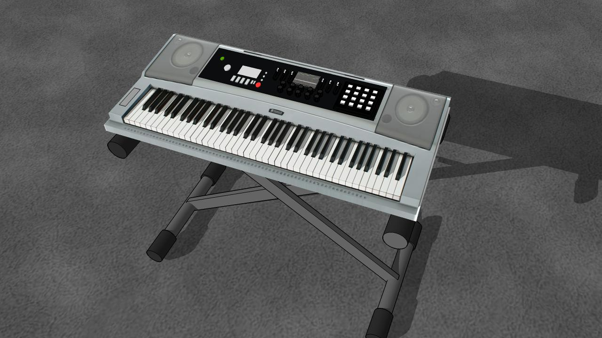
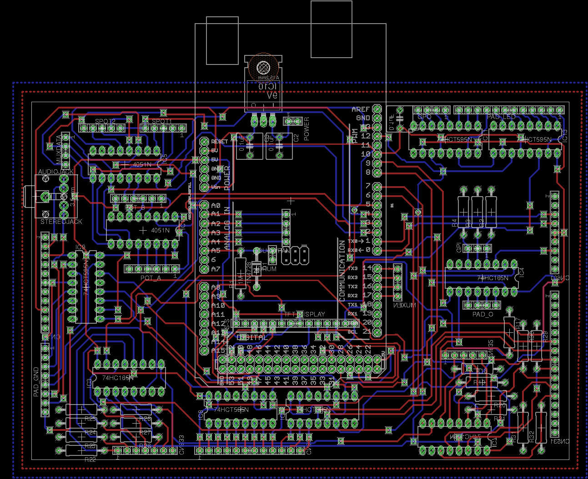

# Pianoduino
A 61 key MIDI keyboard project with Arduino and some parts of a broken Yamaha PSR-E303. With control knobs, buttons, LCD and resistive panel. 

## Getting Started
Since this is a hardware and software project, these instructions will get you a copy of the project up and running on your device for development and testing purposes.  

### Prerequisites

**Arduino Circuit**
First you need to build the [circuit](PCB/Pianoduino/Mainboard.brd) if you have a Yamaha PSR-E303, or you can modify it to fit your keys circuit.

**Arduino IDE** to edit and upload your code.
You can find the instructions of installation on the Arduino's [page](https://www.arduino.cc/en/Main/Software) depending on your operative system.

**Autodesk Eagle** to edit the circuit.
You can find the instructions of installation on the autodesk's [page](https://www.autodesk.com/products/eagle/free-download) depending on your operative system.

## Deployment

Just upload your code to the arduino + circuit and play :musical_keyboard:.

## Author
* **Malcolm Davis** - *Initial work* - [Pianoduino](https://github.com/malkam03/Pianoduino)

See also the list of [contributors](https://github.com/malkam03/Pianoduino/contributors.md) who participated in this project.

## License

This project is licensed under the MIT License - see the [LICENSE.md](LICENSE.md) file for details.

## Acknowledgments

* [Brian Benchoff](https://hackaday.com/2012/11/28/turning-toy-pianos-into-midi-keyboards/)
* [dylanstout](http://www.instructables.com/id/Arduino-MIDI-Controller/)
* [cgmalantonio](http://www.instructables.com/id/Touch-Screen-Overlay-with-Arduino/)
